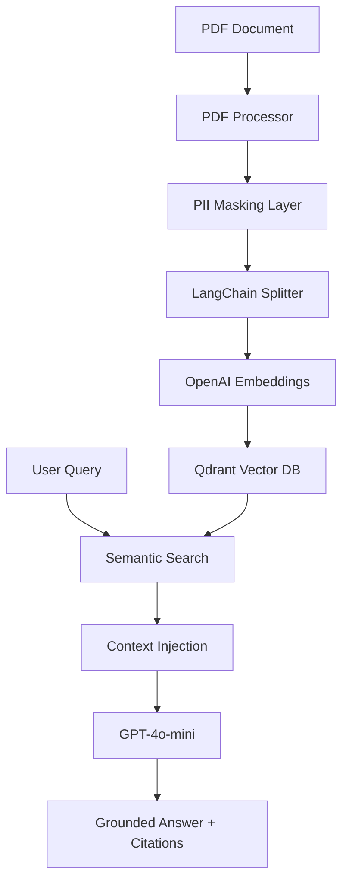

# 🛡️ SecureDoc-AI: Enterprise-Grade RAG System

SecureDoc-AI is a professional-grade Retrieval-Augmented Generation (RAG) system designed for secure document analysis. It bridges the gap between powerful LLMs and sensitive corporate data by implementing PII masking, grounded generation with citations, and efficient vector storage.

---

## 🏗️ Architecture & Pipeline



---

## ✨ Key Features

- **🔐 GDPR-ready PII Masking**: Automatically detects and masks Emails, Phone Numbers, and IBANs *before* data reaches the embedding or storage layer.
- **📄 Multi-page Source Citations**: Every claim made by the assistant is backed by a specific source file and page number reference, e.g., `(Source: contract.pdf, Page: 5)`.
- **⚡ High-Performance Vector Storage**: Powered by **Qdrant**, allowing for complex metadata payloads and advanced filtering directly at the database level.
- **🛡️ Hallucination Control**: Strict prompt engineering enforces the LLM to only use provided context or admit if the information is missing.

---

## 🚀 Quick Start

### 1. Requirements
- Docker & Docker Compose
- OpenAI API Key

### 2. Setup
Create a `.env` file from the example:
```bash
cp .env.example .env
# Edit .env and add your OPENAI_API_KEY
```

### 3. Run with Docker
```bash
docker-compose up -d --build
```

### 4. Direct API Usage (CURL examples)

**Ingest a document:**
```bash
curl -X POST "http://localhost:8000/ingest/file" \
     -H "Content-Type: multipart/form-data" \
     -F "file=@/path/to/your/document.pdf"
```

**Ask a question:**
```bash
curl -X POST "http://localhost:8000/chat" \
     -H "Content-Type: application/json" \
     -d '{"query": "What are the main coverage limits in the policy?"}'
```

---

## 🛠️ Tech Stack

| Component | Technology | Why? |
|-----------|------------|------|
| **Core Framework** | FastAPI | Modern, high-performance, and excellent Pydantic v2 support. |
| **Vector DB** | Qdrant | Optimized for production scale with rich payload filtering. |
| **Orchestration** | LangChain | Industry standard for building robust LLM chains. |
| **LLM** | OpenAI GPT-4o-mini | Perfect balance between cost, speed, and reasoning capability. |
| **Processing** | PyPDF | Reliable parsing of complex document structures. |
| **Logging** | structlog | Structured logging for observability and auditing. |

---

## 🧪 Quality Assurance

We maintain a high standard of reliability through comprehensive testing:
- **Unit Tests**: Coverage for PII masking and document processing.
- **Integration Tests**: Mocked end-to-end flows for RAG logic.
- **CI/CD**: Automated testing on every push via GitHub Actions.

To run tests locally:
```bash
pytest
```

---

*Built with ❤️ for AI Solutions by Antigravity*
